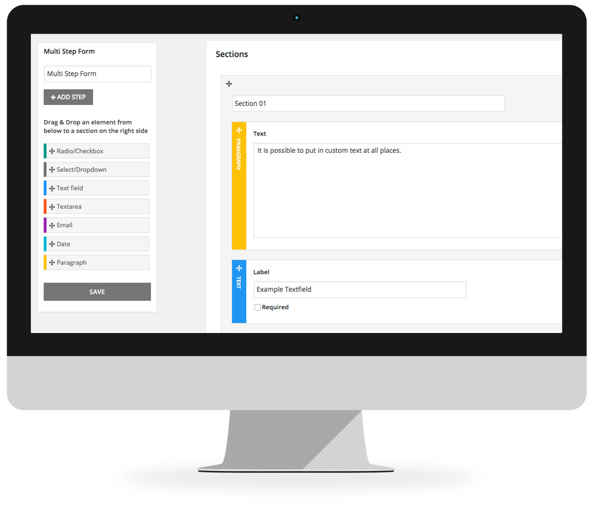

# Multi Step Form 
Backend                                      |  Frontend
:-------------------------------------------:|:---------------------------------------------:
 | 

## Description 
Multi Step Form has a drag & drop enabled form builder for quick and intuitive creation of nice-looking multi step forms. Forms can be embedded on any page or post with shortcodes.

## Features

### Animated progress bar
Use our customizable & animated progress bar to guide your users through your forms. Change the colors to match your corporate identity (CI).

### Fully responsive
Perfect for mobile access! The frontend of Multi Step Form is fully responsive. It can be used and submitted on all devices. We made sure that the form output can be optimally displayed on all screen resolutions.

### Drag & Drop 
Creating forms is as easy as never before. Use drag & drop to place the fields in your form. Fields can be moved and rearranged at any time. The individual steps can also be moved so that the sequence can be reordered or expanded effortlessly.

### Easy Backend
The backend's structure is simple. Even less technical users can quickly understand the plugin and start creating forms.


## Contributing
We would really appreciate pull requests for features or bugfixes.

### Using `docker-compose`

Here's what you need:
* a running Docker engine
* `npm`

To get started, clone this repository to your local drive and run the following commands:

```bash
cd multi-step-form
npm install

docker-compose build
npm start
```

The last command compiles the required CSS and packs the JavaScript code. It will watch the source files for changes and recompiles them on a change. Stop it with Ctrl+C.

Now you can start the required docker containers and install WordPress for the first time with:
```bash
docker-compose up -d

# The next step installs WP. You just need to run this once.
docker-compose run --rm wp-cli install-wp
```

If you now open http://localhost/ you should see an installed WordPress instance. You can login with "wordpress" as username and password.

If you want to change JS or LESS Code, start `gulp` with:
```bash
npm start
```
and let it run while you work.

To stop the server, just run:
```bash
docker-compose down
```

### Actions / Filters

Visit the wiki at [GitHub](https://github.com/mlooft/multi-step-form/wiki/Hooks) for a list of Wordpress actions / filters multi-step-form creates.

### Update language files

You can update the .pot language files with:
```bash
npm run lang
```

### Build an installable archive

To export the project to an installable wordpress plugin .zip file, you only need to run:
```bash
npm run zip
```

### Release a new version

**Make sure you are on the master branch!**

**Always test before releasing a new version!**

Publishing a new version can only be done by listed and approved contributors of this plugin. To create a new release, just tag the repository locally with:
```bash
# VERSION is the new version number
git tag VERSION

# E.g.:
git tag 1.6.1
```

After that you can push this tag to GitHub with:
```bash
git push origin --tags
```

After that, a GitHub Actions Workflow is started which builds the project and uploads it to the Wordpress.org repository automatically. Check that the updated worked by visiting [the plugin page](https://wordpress.org/plugins/multi-step-form/).

## Links
* **[Beginners Tutorial](http://mondula.com/en/2017/01/06/multi-step-form-anleitung/ "Multi Step Form | Beginners Tutorial")**

* **[Live demo](http://demo.multi-step-form.mondula.com/ "Multi Step Form | Live Demo")**

* **[Product page](http://multi-step-form.mondula.com/ "Multi Step Form")**

* **[Wordpress Plugin Repository](https://wordpress.org/plugins/multi-step-form/)**
